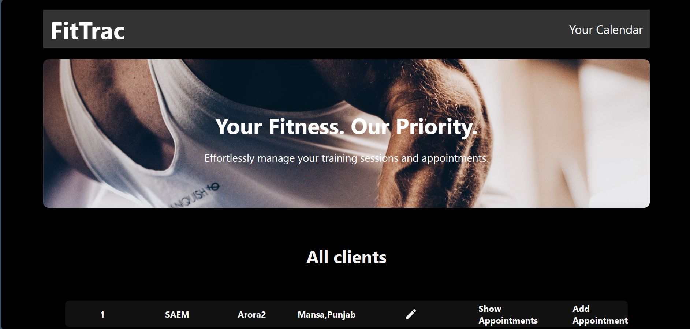
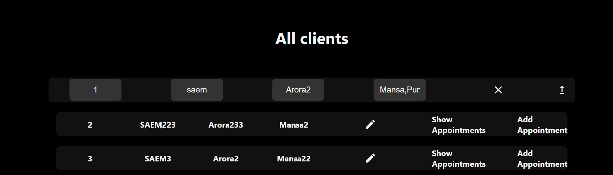
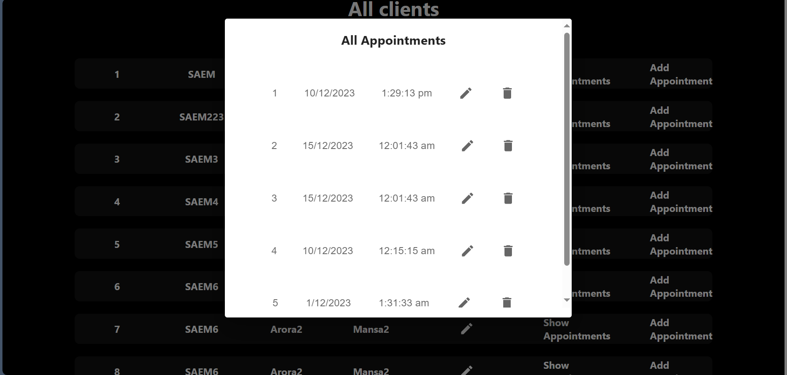
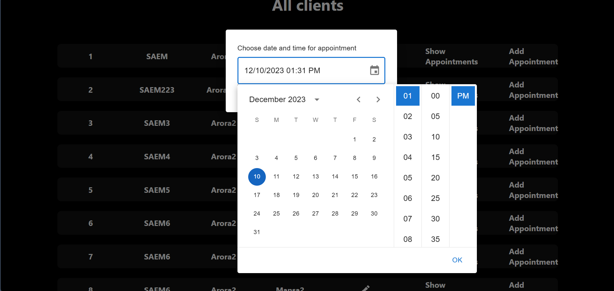
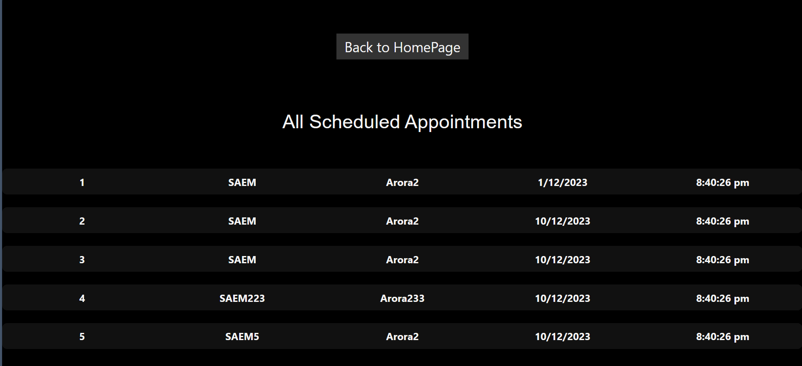
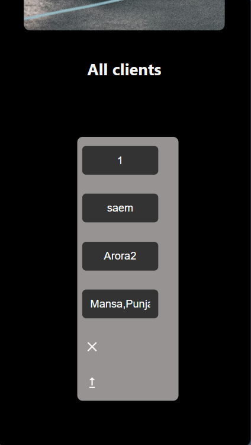

# FitTrac

Welcome to the FitTrac! 🏋️‍♂️ This dashboard allows fitness trainers to efficiently manage client appointments, update client information, and keep track of their schedules.

## Client List

In the client list, you'll find detailed information about each client, including their first name, last name, and location. To make quick updates to a client's information, simply click on the pencil icon next to their details.

### Actions per Client Row


- **Show Appointments**: View all scheduled appointments for a specific client, where you can easily edit or delete appointments as needed.

- **Add Appointment**: Schedule a new appointment for the selected client.

## Confirmation Popups

To ensure smooth confirmation and prevent accidental actions, the dashboard features popup notifications at the top. These notifications will confirm the successful addition, update, or deletion of appointments. Additionally, for critical actions like deletion, a confirmation prompt will ensure your intentions are clear.

## Trainer's Calendar


To access your comprehensive calendar and view all scheduled appointments across clients, simply click the "Your Calendar" button in the Navbar. This will redirect you to [localhost:3000/Calendar](http://localhost:3000/Calendar), where you can see your overall schedule efficiently.

Feel free to explore the intuitive interface and make the most out of the FitTrac for seamless appointment management! 📅💪


## Getting Started

To run the Fitness Trainer Dashboard locally, follow these steps:

1. Clone the repository:

   ```bash
   git clone https://github.com/saem2002/FitnessTrainer.git

2. In the project directory, to run the project,
start with this command

   ```bash
   npm install

3. It installs all the dependencies required to run the project
then 
   ```bash
   npm start

It runs the app in the development mode.


The page will reload when you make changes.

4. Now to make this app working , you have to start the json server by opening a new terminal and run command
   ```bash
   npx json-server --watch src/clients.json --port 8000

Now json-server can communicate with our frontend requests

5. Now open [http://localhost:3000](http://localhost:3000) to view it in your browser.